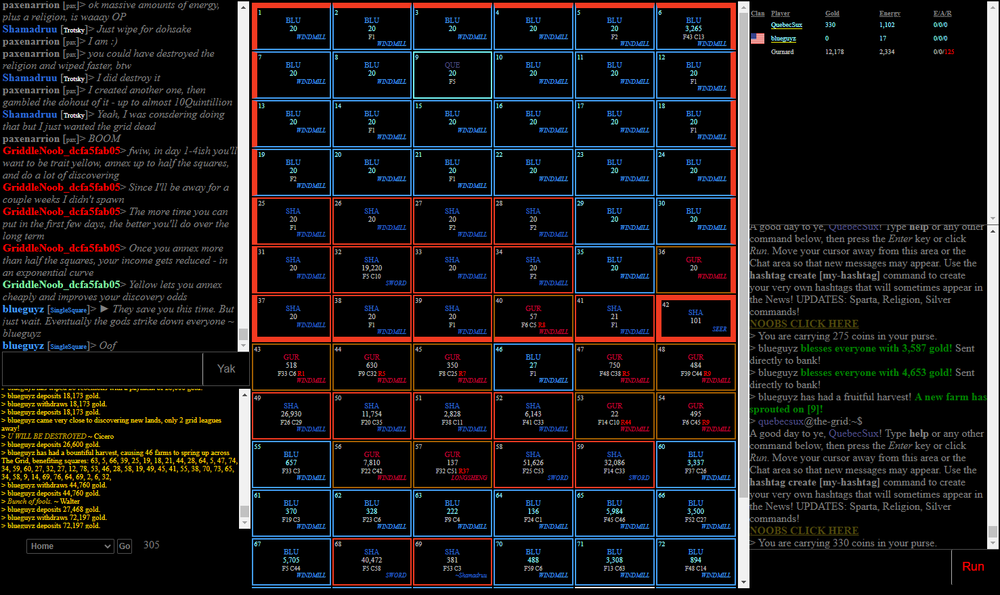

# auto-the-grid2

## About

Use python to script the game [The Grid 2.0](http://codeelf.com/games/the-grid-2/grid/). A text base, web browser multiplayer game.



>The Grid is the sort of game I haven’t played in over 10 years. It is a text-only strategy multiplayer game you play by actually typing in commands and fantasizing you are logged in a BBS. It does feel quite a bit like a boardgame and generally has you capturing squares, building farms, hiring wizards, stealing from your neighbors, inciting revolutions, forming alliances and even attempting to bless everyone, while fighting to gather all the resources a powerful master of the grid would need. Fun eh? Well, it is, but it sure isn’t the simplest game to master and, were it not for some incredibly patient and kind players, I’d still be struggling with it. Not that I’m not struggling now, but, at the very least, I do have a vague idea of what I should be doing and am even forming some sort of strategy I believe. Great times ahead!

\- Posted on July 20, 2012 by Cassandra Khaw for [indiegameplus.com](https://indiegamesplus.com/2012/07/browser_game_pick_the_grid)

## Example Usage

Use from within a python interactive shell, jupyter notebook, or within your own custom scripts.

```python
import autogrid2
import selenium

g = game.Game(
    LOGIN_USERNAME, 
    LOGIN_PASSWORD, 
    selenium.webdriver.Firefox())
```

Basic commands:
```python
g.send_command("gold") # Prints the output of this command to the console
g.get_game_log() # Gets the entire games log as a list
g.print_game_log() # Prints the game log to the console
g.get_gold() # Returns your current gold
g.get_energy() # Returns your current energy
g.get_game_stats() # Returns a pandas data frame of the current game stats
```

Example Usage:
```python
# Mine for silver whenever you have enough energy
while True:
    if g.energy() > 25:
        g.send_command("sil m")
```